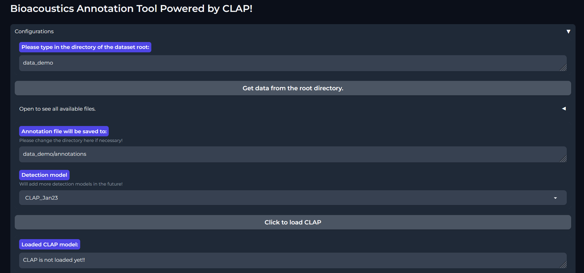
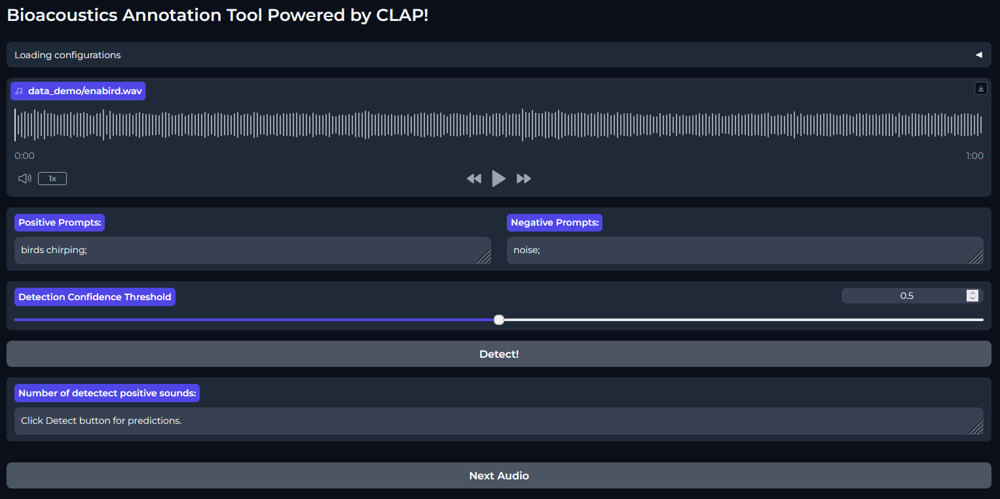
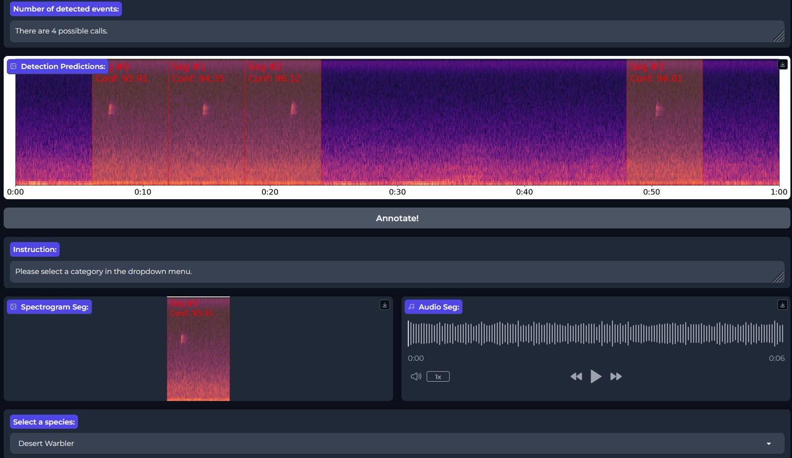

# CLAP (Constrastive Language-Audio Pretraining) Interface

This repository provides a user-friendly interface for the CLAP model, a state-of-the-art audio detection model that leverages positive and negative language prompts for efficient detection. Primarily designed for bird annotation, this tool is versatile enough to accommodate various annotation tasks with custom species or category lists.

## Features

- **Audio File Loading:** Choose a root directory and automatically load audio files.
- **Segment Detection:** Detect positive segments in audio files using language prompts input via the interface.
- **Adjustable Detection Threshold:** Set a detection threshold for predictions to tailor sensitivity according to your needs.
- **Species Classification:** Annotate each segment by selecting from a predefined species list or a custom user-defined list.
- **Result Export:** Save annotation results in a CSV format.
- **Validation Tool:** Load and modify previous annotations for accuracy and refinement.

## Installation

### Prerequisites

Python 3.8

You can install the required dependencies via `requirements.txt` for pip users or `environment.yaml` for Conda users.

### Using `requirements.txt`
   ```bash
   pip install -r requirements.txt
   ```
### Using `environment.yaml` (Conda)

1. Create and activate a Conda environment:

   ```bash
   conda env create -f environment.yaml
   conda activate your_env_name
   ```

   Replace `your_env_name` with the name specified in `environment.yaml`.

## Usage

First download the model weights, `CLAP_Jan23.pth` from this link: https://zenodo.org/records/10573719 and save it to `weights` folder like this: 

```
CLAP_Annotation
|--weights
   |--CLAP_Jan23.pth
```
 
In order to launch the main script to start the Gradio interface, please run the following command.
```bash
python Gradio_Ann.py
```
### Main interface
After installation, run the main script to launch the Gradio interface. Open your web browser and navigate to `http://localhost:7860`.



In this interface you can choose between annotation and validation. During annotation, you can use CLAP to detect and annotate segments in audio files. In validation, you can load and modify previous annotations for accuracy and refinement.

To start annotating segments through the interface, please follow these steps:


1. Select the annotation tab
2. Select the root directory containing your audio files.
3. Input positive and negative prompts for audio detection.
4. Adjust the detection threshold to fine-tune prediction sensitivity.
5. Press the Detect! button to show the detected segments.



Once you hit the Detect! button, the detected segments will be displayed in the interface. You can then annotate each segment by selecting from a predefined species list, this list can be customized by modifying species_list.py. After annotating all segments, you can go to the next audio file in the directory and repeat this process until all audio files have been annotated.

Once all files are annotated, the results will be saved in a csv file in the specified location with the name of the annotator.

If you want to perform validation of a previous annotation file. Select the annotation tab, select the root directory and the interface will load the previous annotations. You can then modify the annotations and save the results in a new csv file.

## License
[CC0-1.0 License](LICENSE)
